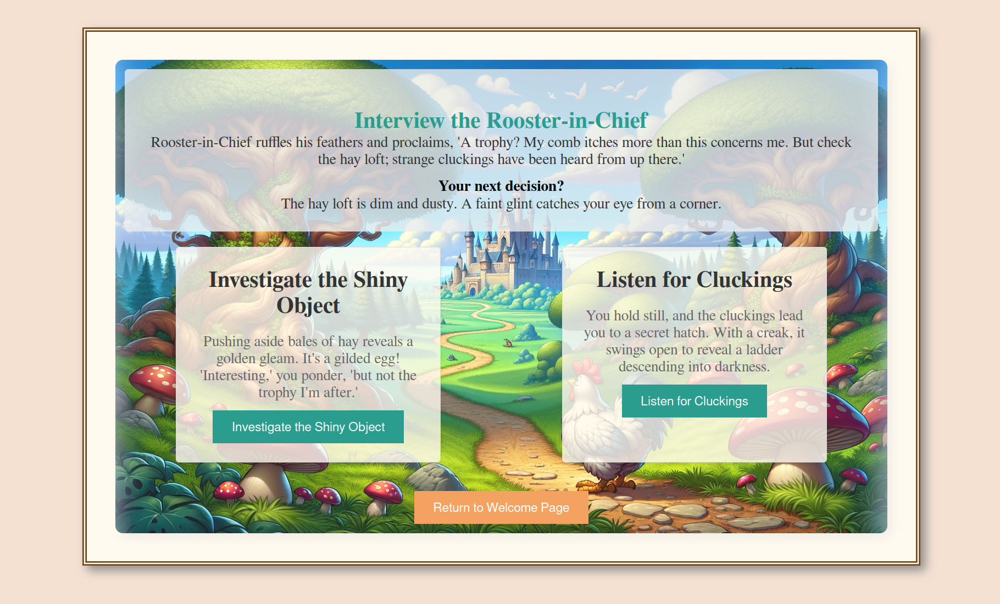

# Quest Adventure Web Application
### Introduction

Quest Adventure is a web-based interactive storytelling game developed as part of my Java learning journey. Players embark on a quest, making decisions that shape their story's path. This application is a showcase of my skills in Java, Servlets, and web development, and is hosted on Render as a part of my study project from Java Rush.
Features

    Interactive story progression based on user decisions.
    Dynamic content loading using Java Servlets.
    Responsive web design for an engaging user experience.

### Technologies Used

    Java
    Servlets (Jakarta EE)
    HTML/CSS/JavaScript
    Gson for JSON processing
    Apache Tomcat as the web server

### Screenshots

  
  

### How to Play

    Start the game from the welcome page.
    Make decisions at each stage of the quest.
    Your choices will lead to different paths and endings.

### Installation and Setup

To run this application locally:

    Clone the repository from GitHub.
    Set up Apache Tomcat server.
    Configure the project in your IDE to use the Tomcat Server.
    Run the application, which will be accessible on http://localhost:8080.

### Tests

The tests are written using JUnit and Mockito.

Test Suites:

    QuestServiceTest: Verifies the logic in the QuestService class, ensuring the correct retrieval of story elements, titles, decisions, and options based on given inputs.
    Servlet Tests (InitQuestServletTest, QuestLogicServletTest, FinishQuestServletTest): Validates servlet behaviors, including request handling, session management, and response redirection.
    QuestRepositoryTest: Confirms the successful loading of quest data from the JSON file.
